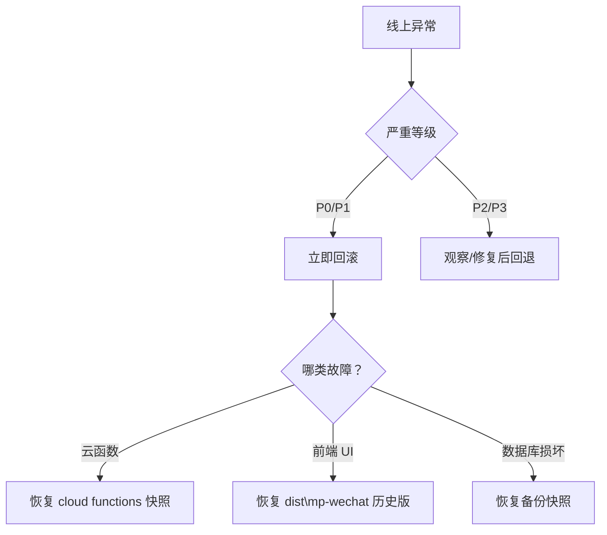

# V2.0 回滚清单（紧急预案）

> commit: `bfb9feb` · 日期：2026-09-07  
> 目标：10 分钟内完成全量回滚至上一可用版本  
> 基线：445 tests ✅ verify 全绿（§7.6/§7.8/§7.4 隐私全覆盖已并入；上一可用灰度快照：commit `e6ec8b3`=441 / `15c2edd`=437，tag `v2.0.0-gray-ready`）

---

## 🎯 回滚决策树



---

## 🔧 回滚步骤（按优先级排序）

### Step 1：云函数快速回滚

#### 微信开发者工具方式

1. 打开 **云开发控制台** → 函数管理 → 选择函数名（如 `home`）
2. 点击「代码部署」→「历史版本」→ 选择上一次成功版本（版本号示例：`v20260906`）
3. 点击「恢复」→ 确认

**重复执行以下函数**：
- ✅ `home/index.js`
- ✅ `opera/index.js`
- ✅ `secscan/index.js`
- ⚠️ 其他 26 个函数保持原状（若无报错）

#### CLI 命令行方式（需 tccli 已安装）

```powershell
# PowerShell
$funcs = @('home', 'opera', 'secscan')
foreach ($f in $funcs) {
    .\node_modules\.bin\tcb.bat deploy --env prod --func $f --rollback-to v20260906
}
```

---

### Step 2：前端发布历史版本

1. 登录 [微信公众平台](https://mp.weixin.qq.com) → 左侧「设置与开发」→「版本管理」
2. 找到已上线版本 → 点击「**重新发布**」
   - 选择最近稳定版本（非当前测试版）
3. 等待审核通过（通常 <1 小时）

**注意**：若当前未通过审核，可直接调用「**撤回审核**」进入下一版本队列

---

### Step 3：数据库快照恢复（仅用于灾难性数据丢失）

1. 云开发控制台 → 数据库 → 右上角「**恢复数据**」
2. 选择时间点 → 建议选择昨天凌晨 02:00（备份周期默认每日一次）
3. **谨慎操作**：会覆盖现有集合（users/members/home_worlds/opera_roster...）

**验证范围**：
- `users` 集合中角色权限是否完整
- `home_worlds` / `home_avatars` 数据一致性
- `audit_logs` 完整性（≥1 年保存要求）

---

## 📋 回滚检查清单

| 动作 | 执行人 | 完成时间 | 备注 |
| --- | --- | --- | --- |
| 云函数 home 恢复旧版 | _______ | HH:mm | 检查日志输出 |
| 云函数 opera 恢复旧版 | _______ | HH:mm+2min | 确认 ticket 逻辑一致 |
| secscan 降级放行模式 | _______ | HH:mm+3min | 临时绕过内容检测 |
| 前端历史版本重发 | _______ | HH:mm+15min | 管理员账号操作 |
| 全链路冒烟测试 | QA | HH:mm+30min | P0 功能回归 5 项 |

---

## 🆘 常见问题 FAQ

### Q1：回滚后前端仍显示新版本按钮？

**解法**：清除缓存
- 用户端：退出小程序重新登录
- 开发端：`npm run dev:mp-wechat` 时勾选「清空缓存」

### Q2：数据库回滚失败？

**解法**：手动补数据
```javascript
// 脚本：scripts/restore-home-worlds.js
const db = wx.getDatabase();
await db.collection('home_worlds').where({ level: 1 }).update({ data: { expNext: 100 } });
```

### Q3：新功能紧急回退但保留核心门禁？

**解法**：部分回滚策略
- 仅回退 `home.world.place`, `avatar.create`
- 保留 `world.init`（只读兼容）

---

## 🛡️ 预防措施（提升回滚成功率）

| 措施 | 状态 | 责任人 |
| --- | --- | --- |
| 每次 commit 前运行 `npm run verify` | ✅ | Developer |
| 云函数每小时自动备份（云开发功能） | ☐ | DevOps |
| PR 审查必含「回滚方案」章节 | ⚠️ | Reviewer |
| 灰测期间记录所有 P0/P1 bug | ✅ | Tester |

---

## 📞 紧急联络人（灰测期）

| 角色 | 姓名 | 电话 | 职责 |
| --- | --- | --- | --- |
| 技术负责人 | _______ | ____ | 最终回滚决策 |
| 运维支持 | _______ | ____ | 云环境协助 |
| 族务对接人 | _______ | ____ | 用户体验反馈 |

---

> **重要**：回滚完成后，请在一小时内发起根因分析会议（post-mortem），形成改进记录归档至 `docs/research/06-成果编制规范与模板.md`
